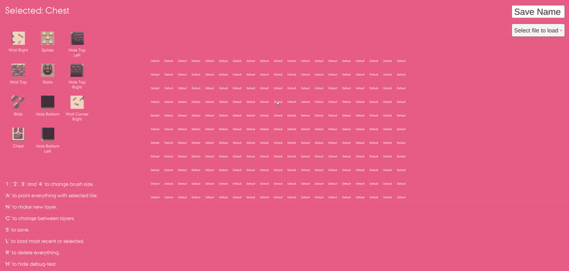
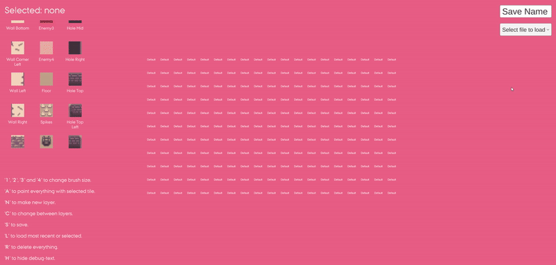

# Tile Map Creation Tool

This Unity project was developed as a personal tool to streamline the creation of maps for my own game prototypes. It was later utilized in the development of the group project game "I Am Happy," which can be played on [itch.io](https://salomes-crescent.itch.io/i-am-happy).

## Overview

The Tile Map Creation Tool functions similarly to Unity’s Tile Palette, with the added capability of embedding logic and entity data directly within each tile. It supports the creation of modular components like enemies, traps, and doors through prefabs and scriptable objects. These components are exposed in the editor, allowing designers to place and modify them as needed.

## Features

- **Entity-Driven Tiles**: Each tile integrates visual and logical data, facilitating the creation of interactive elements within the map.
- **Prefab and ScriptableObject Integration**: Logic is separated into prefabs, while data is managed through scriptable objects, enabling easy modifications and reuse.
- **Multi-Layered Layouts**: Supports multiple layout layers to manage render priority and collision properties.
- **Automated Entity Assembly**: Upon loading a map, prefabs and scriptable objects are automatically combined to form complete entities.

## Potential Enhancements

- **UI Buttons and Icons**: Adding buttons and icons for frequently used functions, complementing the existing keyboard shortcuts, to improve usability and accessibility.

## Sample Scene

The project includes a sample scene featuring pre-made tiles and maps to demonstrate the tool's capabilities. While the project does not include functionality for playing the created maps within the tool itself, some of the included maps can be seen in action within the "I Am Happy" project.

## Sprite Notes

The beautiful sprites used in the project were not made by me, and were downloaded from a now-defunct itch.io page. If anyone has information of the original designer, kindly contact me.